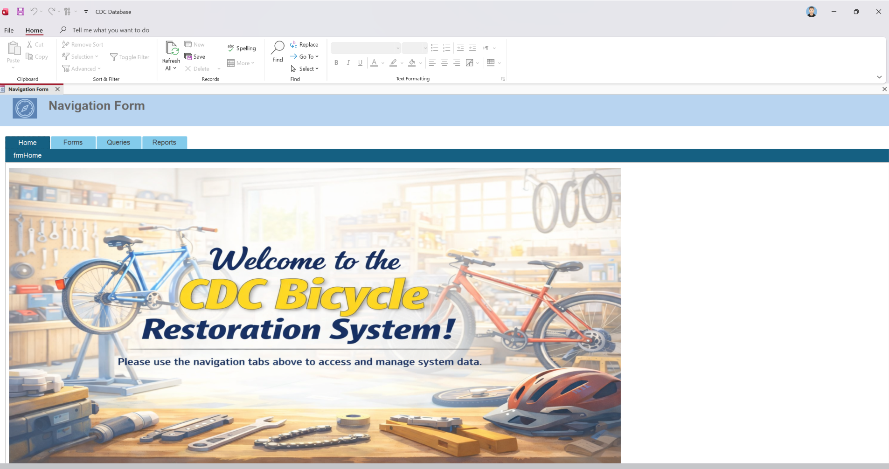
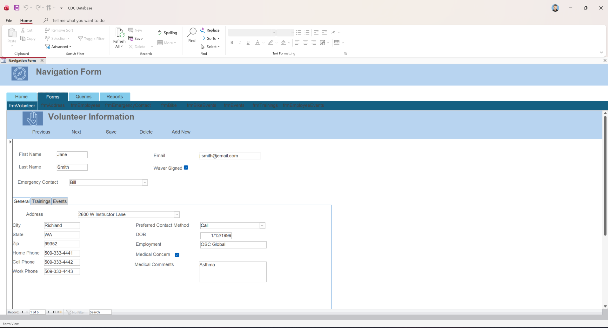
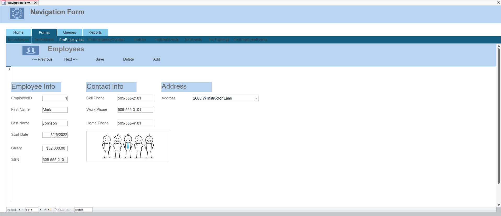
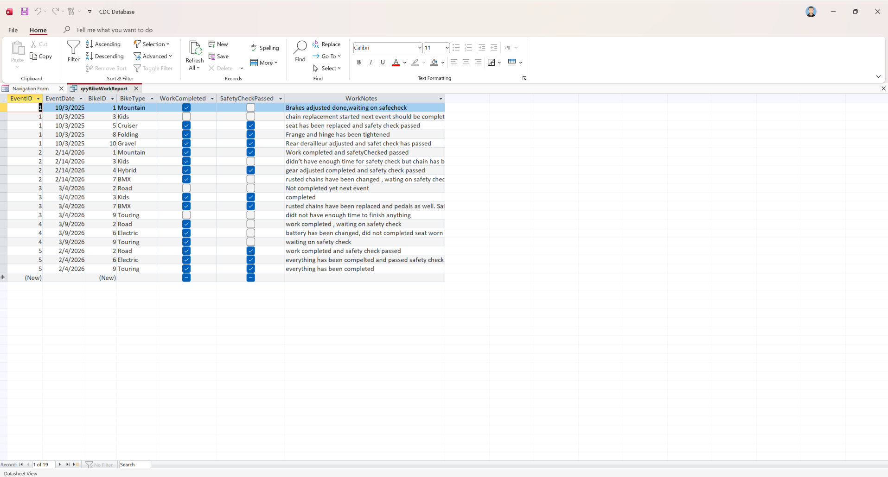
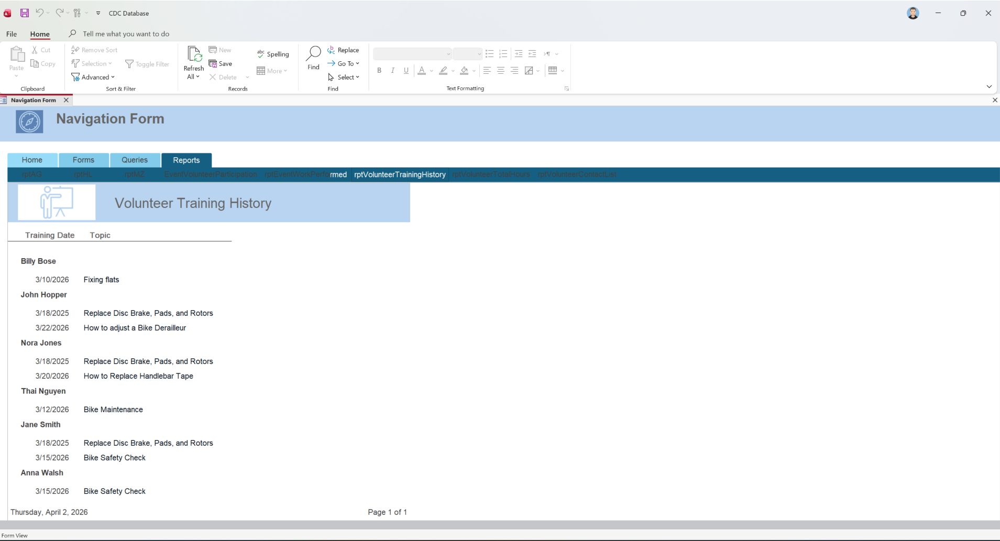
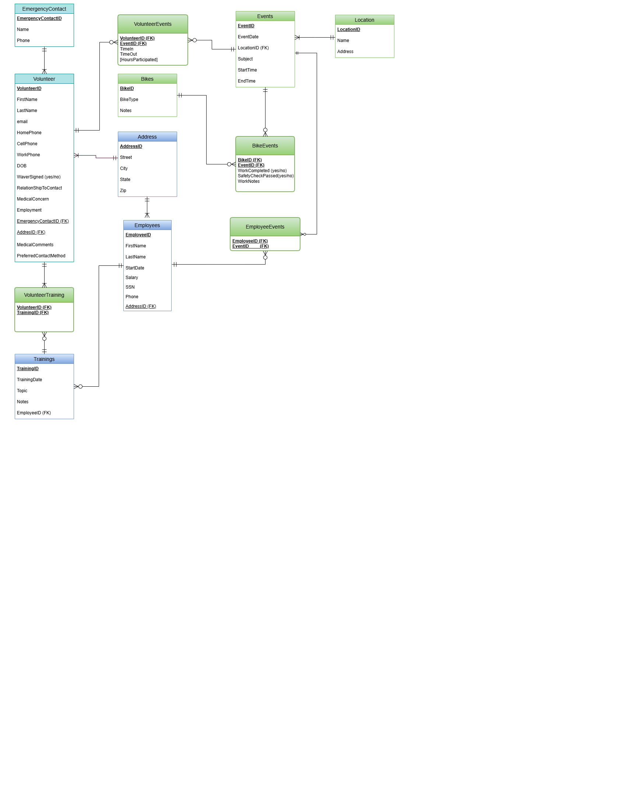

# CDC Database System

This project consists of the design and implementation of a relational database system for a nonprofit organization (Contoso Donation Centers).

## Overview
The system manages:
- Volunteers
- Employees
- Events
- Bicycle restoration processes

## Database Design
- Created an Entity-Relationship Diagram (ERD)
- Transformed into a relational schema
- Normalized up to Third Normal Form (3NF)

## Features
- Data integrity enforced with primary and foreign keys
- SQL queries for reporting and analysis
- Microsoft Access forms for data entry
- Reports for tracking volunteer participation and event performance

## Technologies Used
- Microsoft Access
- SQL
- Database Design (ERD, Normalization)

## Documentation
See the final documentation file included in this repository.

## Screenshots

### System Navigation

### Volunteer Form

### Employee Form

### Query Results

### Report Example

### Database Design (ERD)

## Note
This database uses sample data for demonstration purposes only.
